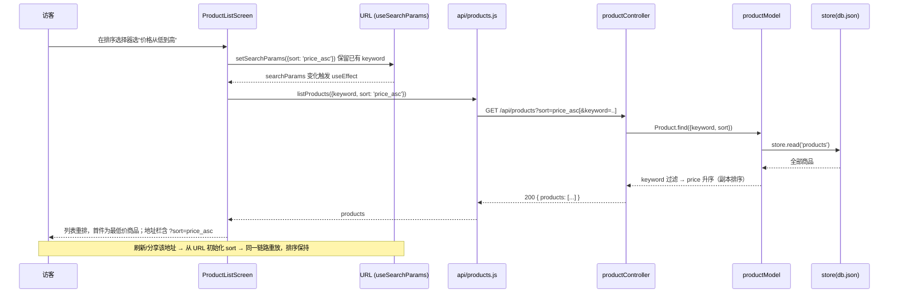
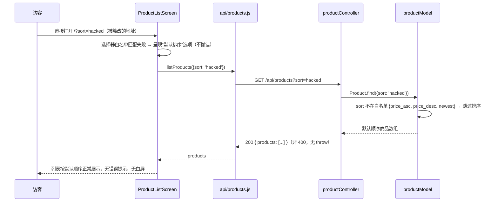
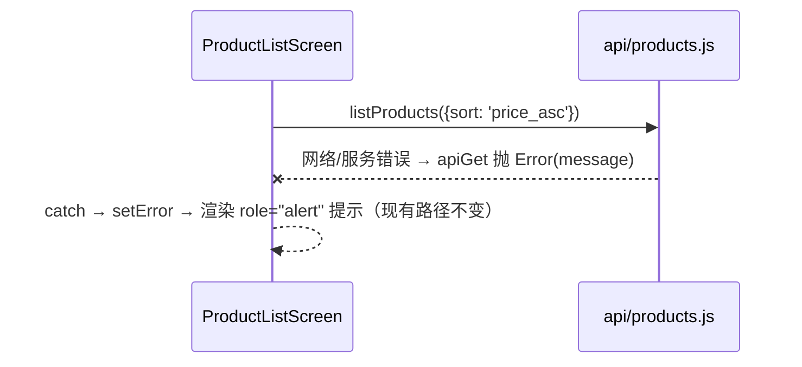

# product-sort — 技术方案（SA 产出）

## 导航头
- R/S 覆盖：PRD-R-005 ~ PRD-R-006；PRD-S-010 ~ PRD-S-016
- specs 变更状态：Draft（待 PM Spec Merge 后转 Updated）
- 文档状态：Updated

## 需求 → 技术落实（对照表）

| R | S | 需求表述 | 技术落实 |
|---|---|---|---|
| PRD-R-005 | PRD-S-010 | 价格从低到高排序，首件为全场最低价 | `GET /api/products` 新增查询参数 `sort=price_asc`；`Product.find` 在 keyword 过滤后按 `price` 升序返回（复制数组再排，不改 store 内数据） |
| PRD-R-005 | PRD-S-011 | 价格从高到低排序，首件为全场最高价 | 同上，`sort=price_desc`，按 `price` 降序 |
| PRD-R-005 | PRD-S-012 | 最新上架排序，首件为最近上架商品 | 同上，`sort=newest`，按 `createdAt`（ISO 时间戳）从新到旧 |
| PRD-R-005 | PRD-S-013 | 未选择排序时保持现有默认顺序 | `sort` 缺省时 `Product.find` 不排序，按 store 原始顺序返回（与上线前完全一致）；前端选择器默认选中"默认排序"空值项，不向 URL 写入 `sort` |
| PRD-R-005 | PRD-S-014 | 排序与关键词搜索并存，不改变过滤范围 | `Product.find({ keyword, sort })` 固定先 keyword 过滤、后排序；前端从 URL 读取 `keyword` 与 `sort` 一并透传给 API，切换排序时保留 `keyword` 参数 |
| PRD-R-006 | PRD-S-015 | 排序选择体现在页面地址，刷新/分享后保持 | 前端用 react-router-dom `useSearchParams` 作为排序状态唯一来源：选择排序 → 写入 `?sort=<value>` → 触发重新请求；刷新/新开页面时从 URL 初始化选择器与请求参数 |
| PRD-R-006 | PRD-S-016 | 地址中排序值不合法时按默认顺序展示，不报错不白屏 | 双端白名单：后端 `sort` 不在 `{price_asc, price_desc, newest}` 内一律忽略（返回 200 + 默认顺序，绝不 400）；前端选择器对未知值回退到空值项，列表照常渲染 |
| 非功能-稳定性 | — | 任何不合法排序输入不得报错/白屏 | 排序逻辑集中在 Model 层白名单分支，未命中即原样返回；无 throw 路径 |
| 非功能-兼容性 | — | 未携带排序的既有地址行为不变 | `sort` 为可选参数，缺省分支零改动语义；既有接口响应结构 `{ products }` 不变 |
| 非功能-性能 | — | 不引入可感知等待 | 内存数组排序（≤ 数十条），O(n log n)，无新增网络往返（排序随列表请求一次完成） |

## 设计概览

- **方案目标**：在现有 `GET /api/products` 接口上新增可选排序参数，前端商品列表页增加排序选择器，排序状态以 URL 查询参数为唯一持久化载体。
- **现状改动**：后端改 `productModel.find` + `productController.getProducts` 两处；前端改 `api/products.js` + `ProductListScreen.jsx` 两处。无新文件（测试与 e2e 资产除外）、无新路由、无新依赖。
- **关键取舍**：
  1. **排序放后端而非前端内存排序**——排序语义与 keyword 过滤同层收敛在 `Product.find`，天然满足"先过滤后排序"（PRD-S-014），且 API 层面可独立单测；前端只负责透传参数与展示。
  2. **URL 参数即状态，不引入全局状态库**——遵循 frontend-arch"引入全局状态前先论证"约束，`useSearchParams` 足够，刷新/分享天然保持（PRD-S-015）。
  3. **不合法值静默降级而非 400**——需求稳定性条款要求"不报错、不白屏"，故后端对未知 `sort` 忽略而非拒绝。
- **已知风险**：`ProductListScreen` 现有 `useEffect` 依赖为空数组，需改为依赖 URL 参数触发重新请求；组件测试需相应包一层 Router 上下文（现有测试模式已具备 @testing-library/react + jsdom）。

## 总体设计

- **组件边界**：
  - Model（`backend/models/productModel.js`）：数据过滤 + 排序的唯一实现点，白名单校验在此。
  - Controller（`backend/controllers/productController.js`）：薄透传 `req.query.sort`，维持 asyncHandler 模式。
  - 前端 API 层（`frontend/src/api/products.js`）：`listProducts({ keyword, sort })` 拼查询串，组件内仍无裸 fetch（verify C4）。
  - Screen（`frontend/src/screens/ProductListScreen.jsx`）：排序选择器 UI + `useSearchParams` 读写 + 依赖参数重新请求。
- **关键调用链**：
  `ProductListScreen (useSearchParams)` → `listProducts({keyword, sort})` → `apiGet('/api/products?...')` → `productController.getProducts` → `Product.find({keyword, sort})` → `store.read('products')`
- **鉴权位置**：无变化。排序挂在公开的 `GET /api/products` 上，不经过 protect/admin；CSTR-001（写操作须登录）不受影响。

## 业务流程与时序

### 主链路：访客选择排序（PRD-S-010/011/012/015）

### 异常链路：地址中排序值不合法（PRD-S-016）

### 异常链路：列表加载失败（既有 PRD-S-002 回归，行为不变）

## 模块拆分与改动范围

### Backend

| 模块 | 职责 | 输入 → 输出 | 受影响文件 |
|---|---|---|---|
| Product Model | keyword 过滤后按白名单排序；未知/缺省 sort 原序返回；排序用数组副本（`[...rows].sort`），禁止原地修改 store 返回的数组 | `find({keyword?, sort?})` → 商品数组 | `backend/models/productModel.js` |
| Product Controller | 透传 `req.query.sort` 到 Model；响应结构不变 | `GET /api/products?keyword=&sort=` → `200 {products}` | `backend/controllers/productController.js` |
| 后端单测 | 覆盖三种排序、缺省、不合法值、keyword+sort 组合、同值稳定性不作断言 | — | `backend/__tests__/controllers/productController.test.js`（扩充） |

排序比较规则：
- `price_asc` / `price_desc`：`Number(price)` 数值比较
- `newest`：`Date.parse(createdAt)` 数值比较，从新到旧（种子数据均为合法 ISO 串；解析 NaN 的脏数据排在末尾即可，不抛错）

### Frontend

| 模块 | 职责 | 输入 → 输出 | 受影响文件 |
|---|---|---|---|
| products API | 接受 `{keyword, sort}`，用 `URLSearchParams` 拼查询串；空值不拼 | `listProducts(params?)` → Promise | `frontend/src/api/products.js` |
| ProductListScreen | 新增 `<select data-testid="sort-select">`（选项：默认排序/价格从低到高/价格从高到低/最新上架）；`useSearchParams` 读写 `sort`、透传保留 `keyword`；选择"默认排序"时从 URL 移除 `sort` 参数；useEffect 依赖 searchParams 重新请求 | URL `?sort=&keyword=` → 排序后列表 | `frontend/src/screens/ProductListScreen.jsx` |
| 组件测试 | mock `api/products.js`，断言：选择排序后调用参数正确、URL 更新、不合法初始值回退默认、错误路径 alert 不变 | — | `frontend/src/screens/ProductListScreen.test.jsx`（新增） |

不改动：`frontend/src/main.jsx`（无新路由）、`frontend/src/api/client.js`、`Price.jsx`、后端路由/中间件/store 层、种子数据。

## 接口设计

**GET /api/products**（扩展既有接口，无新端点）

- 鉴权：无（公开）
- 请求查询参数：

| 参数 | 必填 | 取值 | 语义 |
|---|---|---|---|
| `keyword` | 否 | 任意字符串 | 既有：名称包含匹配，大小写不敏感（行为不变） |
| `sort` | 否 | `price_asc` \| `price_desc` \| `newest` | 新增：对过滤结果集排序；其他任意值 = 未提供（忽略） |

- 响应：`200 { "products": [ { id, name, price, description, createdAt } ] }`（结构与字段完全不变，仅数组顺序受 `sort` 影响）
- 关键错误语义：**`sort` 不合法不产生错误**——仍 200 + 默认顺序（PRD-S-016 / 稳定性条款）；其余错误路径（500 等）沿用现有 errorHandler，不新增状态码。
- 执行顺序契约：keyword 过滤 → sort 排序（保证 PRD-S-014"排序不改变过滤范围"）。

**前端 URL 契约**（页面地址即排序持久化载体，PRD-R-006）：

| 页面地址 | 行为 |
|---|---|
| `/` | 默认顺序，选择器显示"默认排序" |
| `/?sort=price_asc` 等三个合法值 | 对应排序，选择器同步选中 |
| `/?sort=<非法值>` | 默认顺序展示，选择器回退"默认排序"，无错误 UI |
| `/?keyword=x&sort=price_asc` | 先过滤后排序，切换排序保留 keyword |

## 数据设计

- **模型变化**：无。排序依据 `price` 与 `createdAt` 均为 Product 现有字段（种子数据已具备），不新增字段、不新增集合。
- **约束与一致性**：排序为纯读操作，`Product.find` 必须对 `store.read` 返回值做副本排序，避免污染 store 内部数组顺序（否则会间接改变"默认顺序"，违反 PRD-S-013）。
- **兼容与迁移**：无迁移。`backend/data/db.json` 结构不变，无需重跑 `npm run data:import`。

## 兼容性 / 回滚 / 降级

- **兼容性**：
  1. 不带 `sort` 的请求走缺省分支，响应顺序与上线前逐字节一致（PRD-S-013、非功能-兼容性）。
  2. 响应结构 `{ products }` 不变，商品详情跳转（PRD-R-003）、关键词搜索（PRD-R-002）、管理员创建（PRD-R-004）零感知。
  3. 既有 e2e 回归集（`e2e/products.e2e.js`）无需修改即应保持全绿。
- **回滚**：纯代码回滚（revert 对应 commit）即可，无数据结构变更、无迁移脚本、无配置变更；回滚后带 `?sort=` 的旧分享地址退化为默认顺序展示（未知参数被忽略），不产生错误。
- **降级**：不合法 `sort` 值（选择器外来源、地址篡改）在后端白名单处静默降级为默认顺序（200），前端选择器回退默认项——即"降级路径就是缺省路径"，无独立降级开关，无需运维介入。

## Tasks

### Backend

- [ ] **W-01** [PRD-R-005 / PRD-S-010~014] `backend/models/productModel.js`：`Product.find(filter)` 新增 `sort` 处理——keyword 过滤后，按白名单 `{price_asc, price_desc, newest}` 对数组副本排序（price 数值比较、createdAt 时间比较），白名单外与缺省一律原序返回。预期行为：三种排序正确、不合法值不抛错、不改变 store 内原始顺序。
- [ ] **W-02** [PRD-R-005 / PRD-S-010~014、PRD-S-016] `backend/controllers/productController.js`：`getProducts` 透传 `req.query.sort` 至 `Product.find`，响应结构不变；同步扩充 `backend/__tests__/controllers/productController.test.js`（Dev-owned 单测）：`sort=price_asc/price_desc/newest` 三正向、缺省默认序、`sort=非法值` 返回 200 默认序、`keyword+sort` 组合先过滤后排序。

### Frontend

- [ ] **W-03** [PRD-R-005、PRD-R-006] `frontend/src/api/products.js`：`listProducts({ keyword, sort } = {})` 用 `URLSearchParams` 构造查询串（空/未定义参数不拼入），仍经 `apiGet` 走统一封装。预期行为：无参调用等价于现状 `GET /api/products`。
- [ ] **W-04** [PRD-R-005 / PRD-S-010~014、PRD-R-006 / PRD-S-015~016] `frontend/src/screens/ProductListScreen.jsx`：新增排序选择器 `<select data-testid="sort-select">`（默认排序/价格从低到高/价格从高到低/最新上架），以 `useSearchParams` 为唯一排序状态源——初始化时从 URL 读 `sort`（非法值按空处理），选择时写回 URL（选默认时删除 `sort` 键，始终保留 `keyword` 键），`useEffect` 依赖 searchParams 重新调用 `listProducts`；loading/error 既有路径不变。
- [ ] **W-05** [PRD-S-013~016] `frontend/src/screens/ProductListScreen.test.jsx`（新增，Dev-owned 组件测试，jsdom + @testing-library/react + MemoryRouter）：mock `api/products.js`，断言——选择"价格从低到高"后以 `{sort:'price_asc'}` 重新请求且 URL 更新；初始 URL 含非法 sort 时选择器显示默认项且列表正常渲染；初始 URL 含 `keyword` 时切换排序后 keyword 仍在请求参数中；API 失败仍渲染 `role="alert"`。

### Testing-only (test-engineer)

- [ ] **T-E2E-01** [PRD-S-010~012] `e2e/product-sort.e2e.js` + `e2e/product-sort.cases.md`：三种排序各一条用例——选择排序后断言 `product-list` 首个 `li`：`price_asc` 首件为 "USB-C Hub 8-in-1"（$24.99 全场最低）、`price_desc` 首件为 "iPhone 15 Pro 256GB"（$999.99 全场最高）、`newest` 首件为 "USB-C Hub 8-in-1"（createdAt 2026-05-11 最新）。数据前置：`npm run data:import` 种子 5 件商品（Playwright webServer 现有机制）。
- [ ] **T-E2E-02** [PRD-S-015] 选择"价格从低到高"后断言页面地址含 `sort=price_asc`；`page.reload()` 后断言列表首件仍为最低价商品且 `sort-select` 选中值为 `price_asc`。
- [ ] **T-E2E-03** [PRD-S-016 / 非功能-稳定性] 直接 `page.goto('/?sort=hacked')`：断言 `product-list` 可见且 5 件商品按默认顺序（首件 "Airpods Wireless Bluetooth Headphones"）、无 `role="alert"`、页面非白屏。
- [ ] **T-E2E-04** [PRD-S-014] 直接 `page.goto('/?keyword=iphone&sort=price_asc')`：断言列表仅含名称匹配 iphone 的商品且按价格升序；再切换排序为"价格从高到低"，断言地址仍含 `keyword=iphone` 且结果集不变、顺序反转。
- [ ] **T-E2E-05** [PRD-S-013 / 回归] 无参访问 `/` 断言默认顺序与上线前一致（首件 Airpods）；回归执行既有 `e2e/products.e2e.js` 全绿（列表 5 件、详情跳转、404 提示），证据按现有 e2e 机制留存浏览器断言结果。

> 归属说明：W-02/W-05 内的单元/组件测试随开发任务由 Dev 交付；`e2e/product-sort.e2e.js`、`e2e/product-sort.cases.md`（1:1 对照）与浏览器证据归 test-engineer。本任务无 CSS/视觉类验证点（排序选择器为原生 select，无布局断言需求），故 Testing-only 不含视觉专项。

## 依赖分析

无新增 npm 依赖。

- `useSearchParams` 来自已有 `react-router-dom@^6.26`（deps.md 已登记）
- 排序为原生 `Array.prototype.sort`，后端零新依赖
- 测试沿用已有 vitest / @testing-library/react / @playwright/test，`deps.md` 无需变更

## 结论

PASS

需求文档（requirements.md）经查无实现层夹带：全文以"页面地址 / 排序方式 / 默认顺序"等业务语言表述，未出现 URL 路径、HTTP 动词、参数名、组件名。方案 11 章节齐备，与 specs/products.md 现有能力（PRD-R-001~004）无冲突，无新增依赖，测试归属已拆清。
