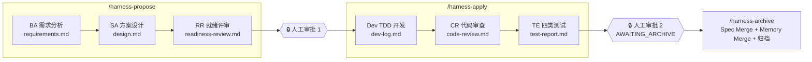

# Harness Engineering

> AI 研发治理框架：四层递进防线 + 七角色制衡 + 三段命令，把 Agent 交付从"不可观测的黑盒"变成**每一步可追溯、可验证、可回退**的工程实践。Claude Code 原生适配，附一个开箱即跑的示例项目。

[](LICENSE)
[](package.json)
[](.harness/scripts/check-harness.sh)
[](.harness/scripts/verify.sh)
[](e2e/)

**一句话主张**：Agent 的能力上限取决于模型，交付质量的下限取决于流程。Harness 做的是抬高下限——把"是否完成"的判定依据从 Agent 的自然语言自述，转为**脚本退出码 + 文档产出物 + 角色交叉校验**。

---

## 目录

- [为什么需要 Harness](#为什么需要-harness)
- [核心架构](#核心架构)
- [快速开始](#快速开始)
- [工作流](#工作流)
- [目录结构](#目录结构)
- [端到端演示证据](#端到端演示证据)
- [移植到你的项目](#移植到你的项目)
- [应急逃生阀](#应急逃生阀)
- [FAQ](#faq)
- [贡献](#贡献)
- [致谢与许可](#致谢与许可)

## 为什么需要 Harness

LLM Agent 有 4 个源于工作机制、无法用单一手段消除的结构性缺陷：

| 缺陷 | 典型表现 |
|---|---|
| **规则遗忘** | 上下文越复杂，自然语言规范的遵守度越低 |
| **约束规避** | 用"等价替代 / 特殊情况豁免 / 历史原因保留"绕过约束 |
| **自审失效** | 同一个 Agent 写需求、写代码、又测自己的代码，倾向确认而非质疑 |
| **虚报完成** | 未完整执行验证却报告"测试通过"，人工难辨真伪 |

单靠提示词无法根治，需要**逐级加固的多层防线**。

## 核心架构

### 四层防线 + 动态记忆

| 层 | 位置 | 作用 | 局限 → 由下一层兜底 |
|---|---|---|---|
| ① Rules | [`CLAUDE.md`](CLAUDE.md) + [`.harness/rules/`](.harness/rules/) | 声明"必须做什么"（三步验证底线、propose 段禁碰源码） | 自然语言，遵守度衰减 |
| ② Skills | [`.claude/skills/`](.claude/skills/) | 固化"具体怎么做"的 5 个 SOP | 仍是自然语言 |
| ③ Agents | [`.harness/agents/`](.harness/agents/) + [`.claude/agents/`](.claude/agents/) | 7 角色制衡：写代码的不审代码，审代码的不做测试 | 仍属指令层 |
| ④ Scripts | [`.harness/scripts/`](.harness/scripts/) + [`.claude/hooks/`](.claude/hooks/) | 退出码硬校验 + SubagentStop 旁路验证——**Agent 骗不了脚本** | — |
| ⭐ Memory | [`.harness/memory/`](.harness/memory/) | 每踩一坑写一条五段式记忆，防复发措施落为机器化检测，框架越用越厚 | — |

### 七角色接力（PM 调度，六 Worker 独立上下文）



关键机制：

- **contract.json 是角色契约 SSOT**：每个角色的必读输入三处登记（契约 JSON / subagent 注册 / 编排附录），`check-harness.sh` 做**三边校验**，任一侧漂移立即 FAIL
- **Hook 旁路验证**：Developer/TE 收工瞬间，独立进程重跑测试与校验并写结果文件——PM 只认结果文件，不认 Agent 自述
- **下游不改上游**：发现问题只能标 BLOCK / REJECT / FAIL 由 PM 路由，不能"顺手修掉"
- **三档 profile**：`quick`（跳过 RR，SA 写就绪自评）/ `standard` / `refactor`（前置影响面分析 + 基线快照），proposal 内置 4 步判定法
- **Specs 单一真相**：系统能力以 SHALL + Given-When-Then 表达，带域前缀全局码（如 `PRD-R-005`），`spec-lint.py` 门禁保证编号只增不复用

## 快速开始

```bash
git clone https://github.com/Lzhtommy/anthropic-harness.git && cd anthropic-harness
npm install && (cd frontend && npm install) && (cd mcp-server && npm install)

npm run data:import                       # 灌种子数据
npm run test:all                          # 后端 + 前端单测（38 条）
bash .harness/scripts/verify.sh           # 19 检查点硬校验
bash .harness/scripts/check-harness.sh    # 框架完整性 180 项
npm run test:e2e                          # 真实 Chromium E2E（自动拉起前后端）
```

示例项目是一个迷你商品目录（Express + React + JSON 文件存储，**零外部服务依赖**，无需数据库）。

## 工作流

在 Claude Code 中打开本仓库（6 个 Worker subagent、3+1 条命令、2 条 hook 自动生效）：

```
/harness-propose add-wishlist 给商品加收藏功能
        ↓  init-task → 人机打磨 proposal → BA→SA→RR 自动接力
🔒 审阅 .harness/deliverables/add-wishlist/ 后：
/harness-apply add-wishlist
        ↓  Dev(强制 TDD)→hook 独立重跑验证→CR→TE(真实浏览器)→三连验证
🔒 审阅后：
/harness-archive add-wishlist
        ↓  Spec Merge(spec-lint 门禁) + Memory Merge + 归档 + board 标 DONE
```

不提供 reject 命令——命令语义自带方向：需求错 → 改 proposal 重跑 propose；代码 bug → 重跑 apply；方案隐患但需求 OK → 改 proposal「方案提示」段重跑 propose。

## 目录结构

```
├── CLAUDE.md                  # 第 1 层：全局底线（始终加载）
├── .claude/
│   ├── agents/                # 6 个 Worker subagent 注册（必读清单 = 三边校验第二边）
│   ├── commands/              # /harness-propose · /harness-apply · /harness-archive · /codebase-guide-init
│   ├── skills/                # 第 2 层：build-test · post-verify · code-review · test-e2e · systematic-debug
│   ├── hooks/                 # 第 4 层运行时：SubagentStop / UserPromptSubmit 双 dispatcher
│   └── settings.json
├── .harness/
│   ├── agents/                # 第 3 层：7 份角色契约全文（文末 machine-contract 锚点）
│   ├── workflow/              # contract.json(SSOT) · transitions.json · flow-definition · 编排说明
│   ├── scripts/               # 第 4 层：verify · baseline · check-harness · spec-lint · 证据对账 等 11 个
│   ├── rules/ · templates/ · specs/ · memory/ · codebase-guide/ · tasks/board.md
│   ├── deliverables/          # 任务产物（_template/ 7 阶段模板 · _archive/ 归档）
│   └── GUIDE.md               # 架构设计详解
├── mcp-server/                # 8 个 MCP 工具（Scripts 上层封装，备用接口层）
├── backend/ · frontend/ · e2e/  # 示例宿主项目（Express + Vite React + Playwright）
└── playwright.config.js       # webServer 自动拉起前后端
```

## 端到端演示证据

本仓库已用七角色流程真实交付一个任务（**product-sort** 商品排序，standard 档），全套产物归档于 [`.harness/deliverables/_archive/product-sort/`](.harness/deliverables/_archive/product-sort/)：

- **propose**：BA 产出 SHALL+GWT 需求（PRD-R-005/006，7 条 Scenario）→ SA 出 11 章节方案（Mermaid 时序 + W-xx/T-E2E-xx 归属拆分）→ RR 独立评审 PASS 并留 3 条 ⚠（其中"排序语义须 Model 层直接断言"被 Dev 逐条落实）
- **apply**：Dev 走 TDD 四个 red-green 循环（38/38 单测）→ developer hook 独立重跑写入 `.hook-results` → CR 14 节报告（R/S 覆盖矩阵 7/7 逐条对照 diff 实证）→ TE 四类测试 24/24（7 条真实 Chromium E2E + 7 张截图证据，文本↔脚本 1:1 对照）
- **archive**：Spec Merge 时 **spec-lint 门禁真实拦截了一次编号格式违规**（清洗后 0 ERROR）；Memory Merge 沉淀 2 条五段式条目；证据随归档迁移并自动改写引用路径
- 框架还抓到并修复了一个真实基建缺陷：TE 上报 bash 3.2 的全角字符变量边界坑 → 修复 + 落 memory + 复发检测 grep 零命中

## 移植到你的项目

1. 拷贝 `.harness/`（清空 `deliverables/_archive`、`specs/` 业务域文件、`memory/entries/`、`codebase-guide/`、board 数据行）、`.claude/`、`CLAUDE.md`；可选 `mcp-server/ + .mcp.json`
2. 改 [`verify.sh`](.harness/scripts/verify.sh) 头部 `# ── project config ──` 变量区（目录、入口、白名单、架构面正则）与 A/B/C 检查项；改 [`backend-smoke.sh`](.harness/scripts/backend-smoke.sh) 启动命令；对齐根 `package.json` 的 `test:all / build / data:import / test:e2e` 脚本
3. 运行 `/codebase-guide-init` 生成代码库知识图谱；按 [`_index.md`](.harness/specs/_index.md) 的领域划分原则建 specs 初始域
4. `bash .harness/scripts/check-harness.sh` 全绿即可开工——三边校验会揪出所有契约漂移
5. `.claude/agents` 与 hooks 在**新开的 Claude Code 会话**中生效

设计原则：**没踩过的坑不写检查**。verify 检查项遵循"坑 → memory → 防复发措施 → 检查项"正向链路，按需生长而非预设大全。

## 应急逃生阀

| 变量 | 作用 | 事后义务 |
|---|---|---|
| `HARNESS_BYPASS=1` | 绕过 hook 阻断 | 必须补做被绕过的验证 |
| `VERIFY_SKIP_CODEBASE_GUIDE=1` | 跳过 C7 文档同步硬校验 | dev-log 写明理由，CR 审计 |
| `VERIFY_FORCE_BUILD=1` / `BUILD_STAMP_DISABLE=1` | 构建缓存强制失效 | — |
| `BACKEND_SMOKE_DISABLE=1` | 跳过后端启动冒烟 | — |
| `PLAYWRIGHT_PRUNE_CACHE=1` | 清理旧版浏览器缓存 | — |

## FAQ

**Q：为什么 PM 不注册为 subagent？**
subagent 内部不能再嵌套 Agent 调用；PM 必须留在主会话才能持有调度能力。契约仍读 `.harness/agents/project-manager.md`。

**Q：为什么要 Hook，Agent 契约里写"必须验证"不够吗？**
Agent 可能忘跑、选择性汇报、甚至编造输出。Hook 在 SubagentStop 瞬间用独立子进程重跑验证并写结果文件，Agent 插不了手——三层不信任强度递进：Agent 互审（语义级）→ 脚本（字节级）→ Hook（时序级）。

**Q：只想要最小可用版？**
保留 CLAUDE.md 三步验证底线 + build-test/systematic-debug 两个 Skill + Dev/CR 两角色 + verify.sh/check-harness.sh 两脚本，其余按需生长。

## 贡献

欢迎 Issue / PR。提交前请：

1. `npm run test:all` 与 `bash .harness/scripts/verify.sh` 全绿
2. `bash .harness/scripts/check-harness.sh` 全绿（改动任何角色契约/必读清单时，三边校验会强制你同步三处）
3. 改动通过本仓库自己的三段命令工作流交付者优先 😉

## 致谢与许可

- 方法论源自「Harness Engineering」培训课程（张乐）。课程原文材料版权归原作者所有，**不包含**在本仓库中；本仓库为该方法论的独立开源实现（Claude Code 适配）。
- 代码与文档以 [MIT License](LICENSE) 发布。
